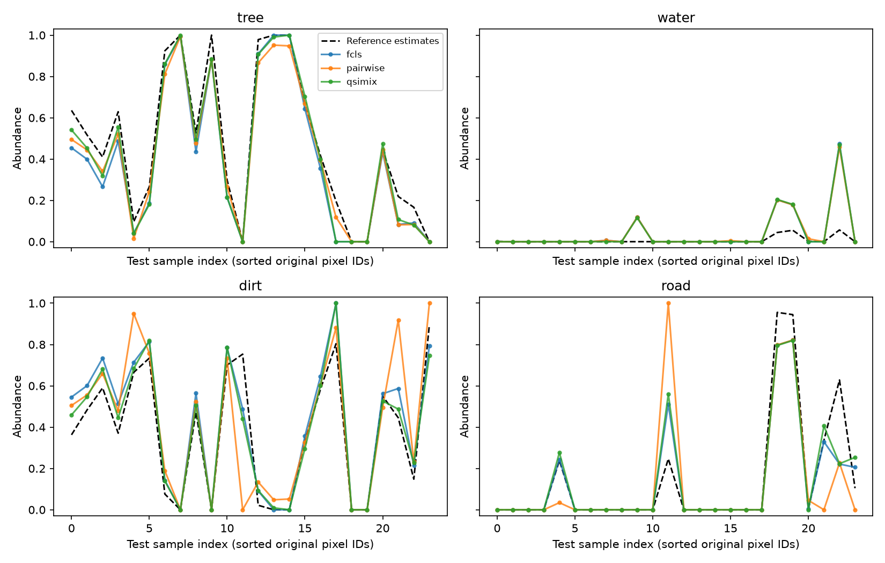

# Jasper Ridge — pilot unmixing nhỏ

Chạy một seed, chọn mẫu trong split spatial cũ; đây là thử pipeline exploratory, chưa phải benchmark đầy đủ.

Dữ liệu: 32 band, train/val/test=64/24/24; 4 vật liệu tree, water, dirt, road. Scale c=1.0874 lấy từ toàn train gốc và known M; Y, M, lambda cùng chia c. RMSE dưới đây đã đổi về thang nominal của EDA. Không clip phổ hoặc xóa outlier.

## Forward tại A_ref (RMSE phổ)

Calibration dùng reference estimates ở train; validation chỉ chọn checkpoint. Forward test dưới đây là đánh giá sau freeze.

| Split | LMM tại A_ref | Pairwise 6 tham số | QSiMix 14 tham số |
|---|---:|---:|---:|
| train | 0.0462720 | 0.0442998 | 0.0451339 |
| val | 0.0480227 | 0.0401855 | 0.0454305 |
| test | 0.0633698 | 0.0592376 | 0.0615173 |

## Inverse trên test

| Model | RMSE phổ | aRMSE với reference | SAM (rad) | SRE (dB) |
|---|---:|---:|---:|---:|
| fcls | 0.0489745 | 0.1014342 | 0.0669084 | 17.7996 |
| pairwise | 0.0431614 | 0.1533348 | 0.0628844 | 18.8971 |
| qsimix | 0.0469697 | 0.0972717 | 0.0649462 | 18.1627 |

| Material | FCLS aRMSE-ref | Pairwise aRMSE-ref | QSiMix aRMSE-ref |
|---|---:|---:|---:|
| tree | 0.0919529 | 0.0733823 | 0.0733644 |
| water | 0.0975119 | 0.0947676 | 0.0967715 |
| dirt | 0.1060056 | 0.2017205 | 0.0961261 |
| road | 0.1093365 | 0.1974570 | 0.1177278 |

QSiMix so với FCLS: ΔRMSE phổ=-0.0020048; ΔaRMSE-reference=-0.0041625 (âm là giảm). Hai chỉ số đo hai điều khác nhau; reconstruction tốt hơn không xác nhận abundance vật lý đúng hơn.

## Coverage và trạng thái solver

| Split | Số mixture (max A_ref < .95) | Dominant tree/water/dirt/road |
|---|---:|---|
| train | 37 | [19, 33, 12, 0] |
| val | 21 | [11, 0, 12, 1] |
| test | 18 | [11, 0, 10, 3] |

Training L-BFGS-B: success=True; CONVERGENCE: NORM OF PROJECTED GRADIENT <= PGTOL. 27 iterations; chọn iteration 2 theo val forward MSE (có LMM initialization); thời gian 5.01s. Ngân sách chạm maxiter không được gọi là hội tụ.

- pairwise: failed starts=0/48, fallback pixels=0; ASC max=2.22e-16, ANC violation=0; inverse 0.11s; output entries ngoài [0,1]=0.
- qsimix: failed starts=0/48, fallback pixels=1; ASC max=2.22e-16, ANC violation=0; inverse 2.58s; output entries ngoài [0,1]=3.

Mỗi pixel chạy FCLS và uniform starts; chọn objective thấp nhất trong các kết quả khả thi, kể cả initial fallback có ghi nhãn. `inverse.json` giữ success/message/abundance/objective từng start và gap giữa hai nghiệm. Đây không phải chứng nhận global optimum.

## Giới hạn và bước nhỏ kế tiếp

- Sampling không dùng nhãn: có thể thiếu một vật liệu trong test nhỏ; giữ nguyên split, không chọn lại seed để làm đẹp kết quả.
- Chỉ đánh giá trên các band đã chọn; không so trực tiếp số này với RMSE toàn cảnh 198 band trong EDA.
- Pairwise là residual có neo với hệ số có dấu, không phải GBM vật lý; regularization cố định, chưa tuning công bằng ngân sách.
- Exact NumPy statevector và finite differences; chưa Adam/autodiff, multi-seed, no-RZZ retraining, certificate, shots hay hardware.
- Residual còn lẫn brightness, variability, scale/reference mismatch; A_ref không phải tỷ lệ đo thực địa. Test cũ đã xuất hiện trong EDA.
- Task tiếp theo trong test_plan.md: kiểm no-RZZ bằng rectangle và retrain cùng subset; chưa cần mở rộng full plan.

Số liệu đầy đủ: [summary.json](summary.json). Dữ liệu nhỏ: [subset.npz](subset.npz). Checkpoint: [checkpoint.npz](checkpoint.npz). Abundance và tái dựng: [inverse.npz](inverse.npz).
