# Jasper Ridge — báo cáo EDA định lượng và chẩn đoán LMM

Phạm vi: toàn cảnh 10,000 pixel × 198 band, 10,000 pixel hợp lệ; thứ tự vật liệu local cood là tree/water/dirt/road. FCLS đạt RMSE phổ 0.04323594, aRMSE 0.08512826 so với reference; LMM dùng A_ref có RMSE 0.05508350. Đây là baseline known-M và mô tả dữ liệu, chưa huấn luyện QSiMix.

## 1. Phạm vi bằng chứng, nguồn và protocol

Mọi thống kê toàn cảnh, correlation, bản đồ, phổ high-purity và phân tích test trong báo cáo đều là mô tả exploratory. Spatial split đã khai báo trước; vì test đã được xem trong EDA, không gọi nó là test confirmatory hoàn toàn chưa quan sát. PCA, ngưỡng median/MAD và khoảng stretch composite chỉ fit bằng valid train. FCLS là suy luận từng pixel dùng Y,M cố định, không dùng A_ref để khởi tạo, chọn nghiệm hoặc hiệu chỉnh scale. M là reference được cung cấp; chưa chứng minh nó được thu độc lập khỏi toàn cảnh.

Zhu 2017 §IV-B mô tả abundance labeling bằng constrained least squares hoặc thuật toán với priors bổ sung. Điều này không chứng minh đầy đủ rằng mọi cột A local chính là output của quy trình đó với đúng M và scale hiện tại. File tên GT không biến A_ref thành đo thực địa. Chưa đủ bằng chứng để khẳng định reflectance đo tuyệt đối, atmospheric correction, nguồn GitHub chính xác hoặc giấy phép của bản local. Báo cáo dùng thang nominal raw/maxValue; các giới hạn nguồn cần đọc cùng source audit.

[Source audit do agent A phụ trách](source_audit.md)

[Đối chiếu PDF với metadata và nguồn sơ cấp](research_decisions.md)

[Zhu 2017: phương pháp tạo nhãn tham chiếu, §IV](https://ar5iv.labs.arxiv.org/html/1708.05125)

[Independent QA do agent D phụ trách](qa_review.md)

[Manifest preprocessing và bằng chứng orientation](../../data/processed/jasper_ridge/manifest.json)

Split theo cột local: train 0–57; buffer 58–59; val 60–77; buffer 78–79; test 80–99. Invalid có label=4 và không fit.

| split | n_pixels |
| --- | --- |
| all_valid_descriptive | 10000 |
| train | 5800 |
| val | 1800 |
| test | 2000 |
| buffer | 400 |

Pixel ID là chỉ số cột Y gốc, 0-based; row=id%100, col=id//100, origin ảnh ở trên. FIG xác nhận F-order của A và giá trị M chính xác; chưa chứng minh độc lập đăng ký pixel Y–A, band M–Y hoặc thang chung Y–M. F-order của Y và phép chia 5000 là convention exploratory dựa trên metadata/mã tham khảo. Các metric dùng chung Y,M,A có điều kiện theo các convention này. Đối chiếu bản đồ cho tính nhất quán trực quan, không thay thế provenance. Roundtrip reshape chỉ xác nhận tính nhất quán số học. Buffer chưa tham gia fit. Nếu nghiên cứu sau dùng patches, cần kiểm footprint và buffer trước khi sử dụng protocol này.

## 2. Inventory, scale và numerical QC

| array | shape | dtype | min | max | mean | std | nonfinite |
| --- | --- | --- | --- | --- | --- | --- | --- |
| raw_Y | [198, 10000] | uint16 | 0 | 5437 | 1194.14 | 1031.88 | 0 |
| clean_Y | [198, 10000] | float64 | 0 | 1.0874 | 0.238829 | 0.206377 | 0 |
| M | [198, 4] | float64 | 0 | 0.629057 | 0.270234 | 0.194488 | 0 |
| A_ref | [4, 10000] | float64 | 0 | 1 | 0.25 | 0.349753 | 0 |

Y được cast float64 rồi chia nominal maxValue=5000; M không chia lần nữa, A_ref không đổi. Có 18 giá trị Y>1 trên 3 pixel, max=1.0874; tất cả giữ nguyên. Không clip clean, không chuẩn hóa từng pixel, không denoise, không bỏ band/crop lần hai. Metadata nBand=224 là số band gốc; 198 hàng hiện tại đã bỏ các khoảng 1–3,108–112,154–166,220–224.

| QC | count_or_error |
| --- | --- |
| nonfinite_entries | 0 |
| negative_entries | 0 |
| zero_entries | 418 |
| all_zero_pixels | 0 |
| all_zero_bands | 0 |
| constant_bands_valid | 0 |
| constant_spectra_valid | 0 |
| duplicate_groups_valid | 0 |
| duplicate_pixels_in_groups_valid | 0 |
| duplicate_excess_copies_valid | 0 |
| invalid_pixels | 0 |
| reference_asc_max_abs | 1.92069e-14 |

Quantile trên toàn bộ entries, không phải quantile của mean pixel. Std dùng ddof=0 trong thống kê mô tả.

| quantile | raw_Y | scaled_Y |
| --- | --- | --- |
| 0 | 0 | 0 |
| 0.01 | 31 | 0.0062 |
| 0.05 | 72 | 0.0144 |
| 0.25 | 212 | 0.0424 |
| 0.5 | 861 | 0.1722 |
| 0.75 | 2108 | 0.4216 |
| 0.95 | 2999 | 0.5998 |
| 0.99 | 3367 | 0.6734 |
| 1 | 5437 | 1.0874 |

Duplicate group đếm nhóm phổ trùng chính xác; membership đếm mọi pixel trong nhóm, excess đếm bản sao ngoài đại diện đầu. Zero đơn lẻ không làm pixel invalid. Outlier/duplicate hợp lệ chỉ được flag và giữ trong cube. CSV theo band ghi original ID, raw range, quantile, zero/nonfinite/>1, signed residual và RMSE; CSV theo pixel giữ ID/row/col/split để truy vết.

[Bảng đủ 198 band](tables/band_statistics.csv)

[Bảng đủ 10.000 pixel](tables/pixel_statistics.csv)

![Composite band-index tùy ý RGB retained indices 0-based [120, 70, 20], original IDs [129, 74, 24]. Stretch 2–98% fit train, clipping chỉ trên ảnh hiển thị. Không gọi true-color/NIR khi chưa có wavelength metadata. Hai panel còn lại là intensity và norm thang nominal.](figures/scene_overview.png)

Composite band-index tùy ý RGB retained indices 0-based [120, 70, 20], original IDs [129, 74, 24]. Stretch 2–98% fit train, clipping chỉ trên ảnh hiển thị. Không gọi true-color/NIR khi chưa có wavelength metadata. Hai panel còn lại là intensity và norm thang nominal.

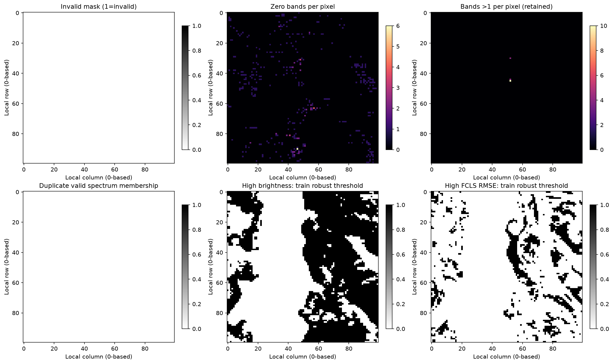

QC trên toàn cảnh, pixel flag vẫn giữ. Mọi bản đồ dùng ID/row/col canonical; màu trắng/đen ở mask là trạng thái, không phải nhãn vật liệu.

## 3. Cấu trúc phổ, brightness và noise proxies

Brightness=mean trên 198 band có mean 0.238829, median 0.294181, p99 0.47356. RMS sai phân phổ chỉ dùng 195 cặp original gap=1, bỏ 2 cặp bắc qua band gaps. Mean RMS proxy theo pixel là 0.0112574; mean spatial-neighbor RMSE proxy là 0.033707. Sai phân phổ chứa độ dốc/hấp thụ phổ và variability; sai phân không gian chứa ranh giới vật liệu, texture và chiếu sáng. Không có phép ước lượng noise độc lập hoặc metadata radiometric để gọi các proxy này là sensor SNR/SNR vật lý.

| direction | pair_count | mean_rmse_proxy | median_rmse_proxy | max_rmse_proxy |
| --- | --- | --- | --- | --- |
| horizontal | 9900 | 0.0360838 | 0.0220428 | 0.423498 |
| vertical | 9900 | 0.0312762 | 0.0196227 | 0.393817 |

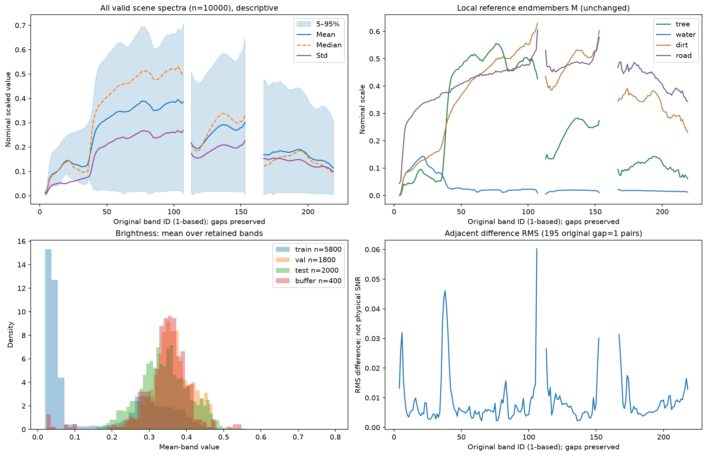

Toàn cảnh hợp lệ, chỉ mô tả: mean/std/median/5–95%, M reference, histogram brightness theo split và adjacent-band proxy. Đường phổ ngắt tại original band gaps.

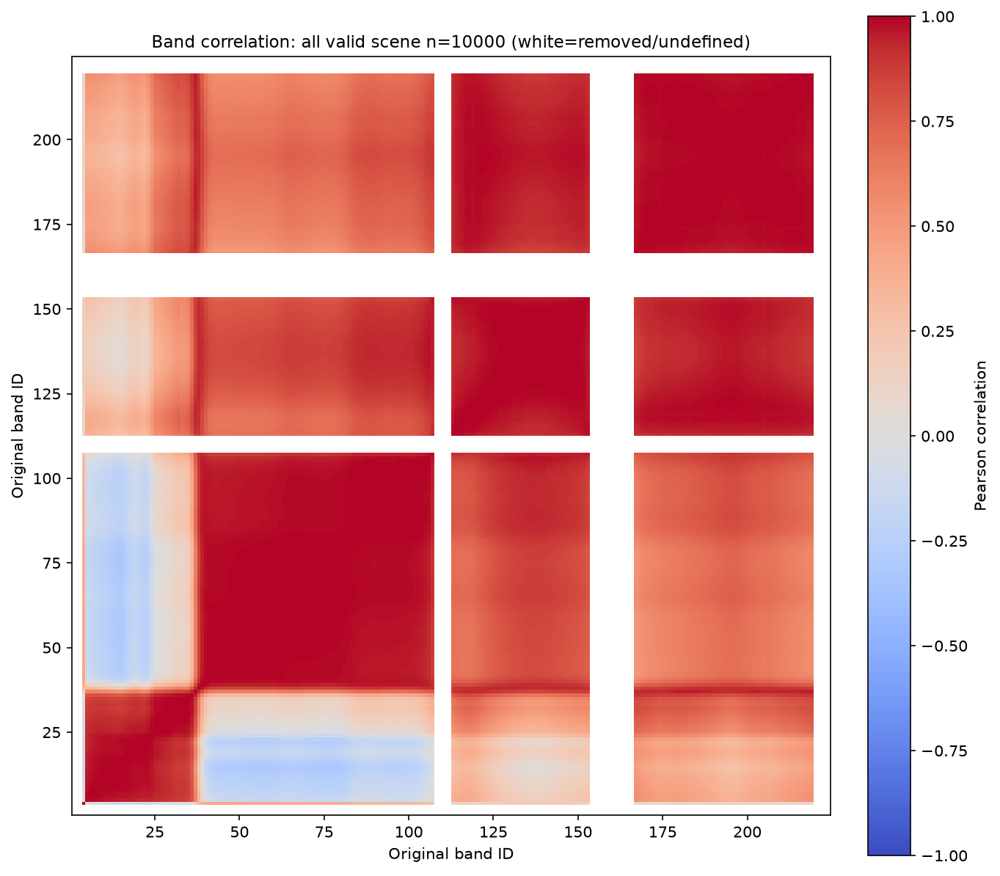

Pearson correlation trên toàn cảnh hợp lệ. Trục original band 1–224; dải trắng là band đã bỏ hoặc correlation không xác định do band hằng. Không fit preprocessing bằng heatmap này.

[Sai phân chỉ trên cặp original band kề nhau](tables/adjacent_band_difference.csv)

## 4. Reference abundance và coverage calibration

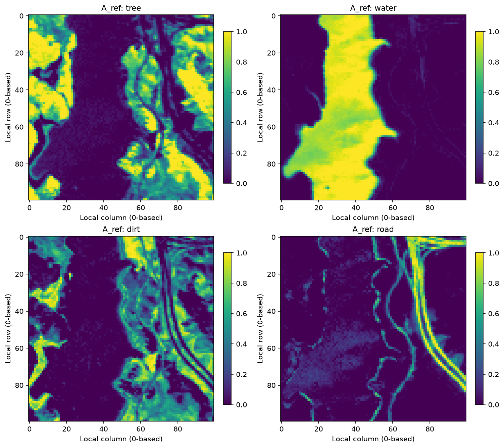

Bốn A_ref theo đúng cood local, colorbar cố định 0–1. Đây là reference abundance, không chứng nhận ground truth đo thực địa.

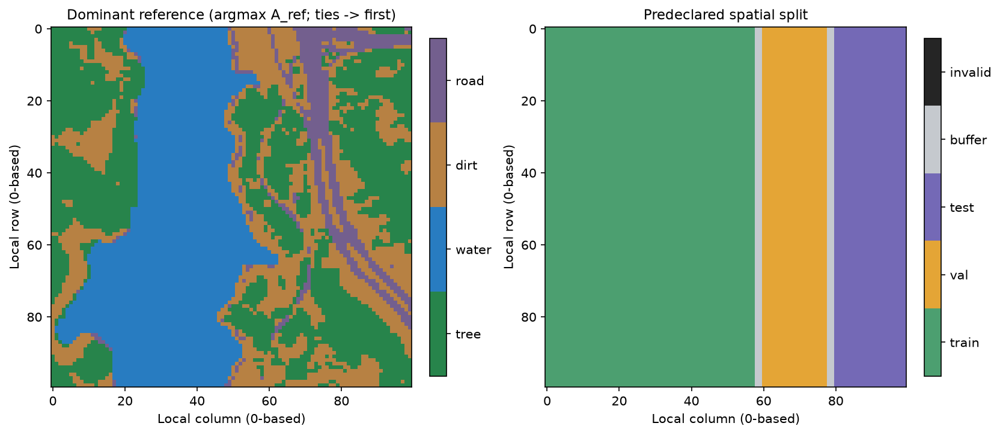

Argmax A_ref là dominant reference map; không gọi classification ground truth. Ties chọn hàng đầu theo thứ tự local. Spatial split giữ nguyên sau EDA.

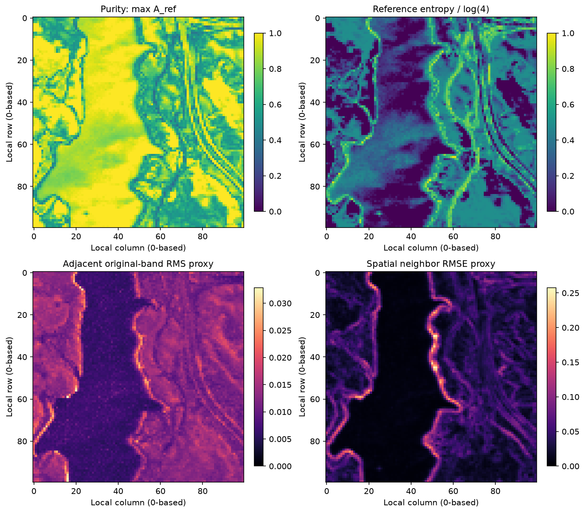

Purity=max(A_ref); entropy=−sum(a log a)/log(4), quy ước 0log0=0. Các bản đồ proxy không phải physical SNR.

Toàn cảnh hợp lệ, mô tả. Mass fraction ở đây là tỷ trọng tổng abundance reference (sum A_e / sum A); không đo khối lượng vật lý.

| material | mean | median | std | mass_fraction_reference | dominant_count | pure_ge_0.90 | pure_ge_0.95 | pure_ge_0.99 |
| --- | --- | --- | --- | --- | --- | --- | --- | --- |
| tree | 0.341736 | 0.165056 | 0.371358 | 0.341736 | 3493 | 1434 | 1204 | 980 |
| water | 0.315026 | 0 | 0.432392 | 0.315026 | 3326 | 2189 | 1650 | 1011 |
| dirt | 0.247842 | 0.095389 | 0.291815 | 0.247842 | 2428 | 304 | 160 | 61 |
| road | 0.0953962 | 0 | 0.206717 | 0.0953962 | 753 | 205 | 135 | 41 |

Coverage từng material × split. Không đổi vùng split dựa trên A_ref hoặc kết quả coverage.

| split | material | n | mean | dominant_count | pure_ge_0.90 | pure_ge_0.95 | pure_ge_0.99 |
| --- | --- | --- | --- | --- | --- | --- | --- |
| train | tree | 5800 | 0.25897 | 1550 | 749 | 629 | 507 |
| train | water | 5800 | 0.536031 | 3306 | 2180 | 1644 | 1005 |
| train | dirt | 5800 | 0.159187 | 859 | 187 | 109 | 42 |
| train | road | 5800 | 0.0458124 | 85 | 0 | 0 | 0 |
| val | tree | 1800 | 0.386374 | 691 | 136 | 110 | 81 |
| val | water | 1800 | 0.0137198 | 10 | 3 | 1 | 1 |
| val | dirt | 1800 | 0.39623 | 720 | 58 | 33 | 15 |
| val | road | 1800 | 0.203676 | 379 | 91 | 48 | 15 |
| test | tree | 2000 | 0.529668 | 1096 | 513 | 434 | 363 |
| test | water | 2000 | 0.00232107 | 0 | 0 | 0 | 0 |
| test | dirt | 2000 | 0.335465 | 663 | 45 | 10 | 0 |
| test | road | 2000 | 0.132546 | 241 | 99 | 75 | 21 |
| buffer | tree | 400 | 0.401306 | 156 | 36 | 31 | 29 |
| buffer | water | 400 | 0.0298551 | 10 | 6 | 5 | 5 |
| buffer | dirt | 400 | 0.427489 | 186 | 14 | 8 | 4 |
| buffer | road | 400 | 0.141351 | 48 | 15 | 12 | 5 |

Policy khai báo: pure khi max A_ref≥threshold; mixed khi thấp hơn. Trong mixed, interior khi mọi A_ref>0.01; boundary/edge khi min A_ref≤0.01. Hai lớp mixed rời nhau và cộng lại đúng mixed_count; boundary bao gồm cả gần mặt 2D và cạnh 1D, không chỉ cạnh hình học chính xác. CSV có cả 0.90/0.95/0.99.

| split | n | pure_threshold | pure_count | mixed_count | mixed_interior_all_a_gt_0.01 | mixed_boundary_min_a_le_0.01 |
| --- | --- | --- | --- | --- | --- | --- |
| all_valid_descriptive | 10000 | 0.95 | 3149 | 6851 | 519 | 6332 |
| train | 5800 | 0.95 | 2382 | 3418 | 242 | 3176 |
| val | 1800 | 0.95 | 192 | 1608 | 192 | 1416 |
| test | 2000 | 0.95 | 519 | 1481 | 49 | 1432 |
| buffer | 400 | 0.95 | 56 | 344 | 36 | 308 |

Train có 3418 mixed pixel tại threshold 0.95, trong đó 242 interior và 3176 boundary; pure count=2382. Material ít pure train nhất theo 0.95 là road: 0 pixel. Đây là căn cứ mô tả khả năng phủ calibration, không phải lý do chọn lại test. Với hard vertex anchor, pure samples có residual parameter gradient bằng 0; cần mixtures để hiệu chuẩn decoder, đồng thời báo thiếu phủ vùng simplex thay vì suy rộng tự động.

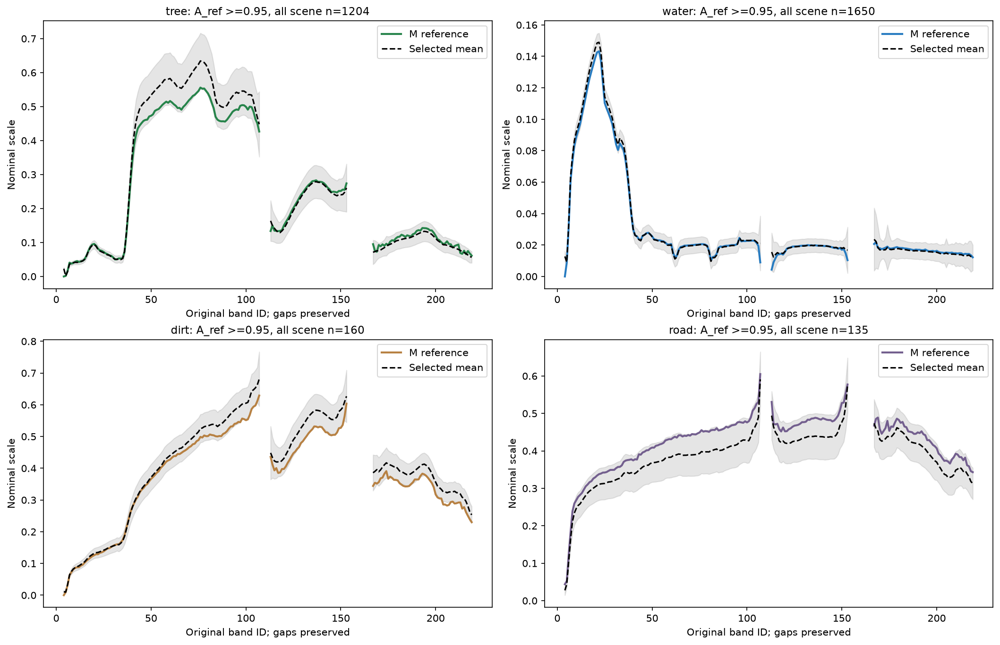

Pixel được chọn bằng A_ref≥0.95; line đen là mean, dải ±1 std, so với M cùng vật liệu. Selection bằng reference chỉ phục vụ mô tả; n nhỏ không cho chứng nhận endmember variability.

Độ lệch mean phổ high-purity với M; SAD trên phổ chưa center, đơn vị degree. Empty selection được ghi undefined, không thay bằng 0.

| split | material | threshold | n_selected_using_A_ref | mean_spectrum_rmse_to_M | mean_spectrum_sad_degrees_to_M | status |
| --- | --- | --- | --- | --- | --- | --- |
| all_valid_descriptive | tree | 0.95 | 1204 | 0.0338389 | 3.07922 | descriptive_A_ref_selection |
| all_valid_descriptive | water | 0.95 | 1650 | 0.00233897 | 2.23199 | descriptive_A_ref_selection |
| all_valid_descriptive | dirt | 0.95 | 160 | 0.0328483 | 1.67676 | descriptive_A_ref_selection |
| all_valid_descriptive | road | 0.95 | 135 | 0.039771 | 1.61887 | descriptive_A_ref_selection |

[Coverage và sai khác high-purity đủ ba threshold, mọi split](tables/high_purity_reference_vs_M.csv)

## 5. Hình học endmember và khả năng nhận dạng

| material_1 | material_2 | sad_radians | sad_degrees | sad_status | euclidean_distance |
| --- | --- | --- | --- | --- | --- |
| tree | water | 1.1407 | 65.3572 | defined | 4.1791 |
| tree | dirt | 0.437666 | 25.0764 | defined | 2.46684 |
| tree | road | 0.559096 | 32.0338 | defined | 3.29017 |
| water | dirt | 1.07147 | 61.3906 | defined | 5.32638 |
| water | road | 0.895402 | 51.3028 | defined | 5.67415 |
| dirt | road | 0.227857 | 13.0553 | defined | 1.39765 |

| matrix | rank | singular_values | condition_number | sigma_min | status |
| --- | --- | --- | --- | --- | --- |
| M | 4 | [9.1160565  1.97209087 0.85760793 0.26053519] | 34.9897 | 0.260535 | defined |
| MQ | 3 | [4.46434306 1.94095195 0.72536021] | 6.15466 | 0.72536 | defined |

Cặp góc nhỏ nhất là dirt/road: SAD=13.0553° (0.227857 rad), Euclidean distance=1.39765. sigma_min(MQ)=0.72536021; Q là Helmert basis trực chuẩn cho 1ᵀa=0, lưu trong NPZ. MQ đo sensitivity trên tangent simplex đúng với ràng buộc tổng abundance; condition M và MQ được báo riêng. SAD nhỏ cho phổ gần cùng hướng, nhưng brightness/độ dài phổ vẫn ảnh hưởng inverse nên phải đọc cùng Euclidean/singular values. Rank deficiency khiến condition number undefined (JSON null + status). Không áp dụng SAD cho spectra đã PCA-center. sigma_min(MQ)>0 hỗ trợ tính duy nhất baseline tuyến tính trong precision hiện tại; chưa chứng nhận điều kiện nonlinear sigma>kappa của QSiMix.

## 6. PCA chỉ fit train

Mean và covariance fit trên 5800 valid train pixels bằng numpy.linalg.eigh; covariance chia n_train−1. PC1 giải thích 91.6627% variance train; ba PC đầu cộng 99.4746%. Số PC đạt 95/99/99.9% lần lượt là 2/2/7. Các split và M cùng transform (X−mean_train), không refit. PCA dimension phản ánh variance dữ liệu trong scale này, không chứng minh có bấy nhiêu endmember và không phải HySime/MNF. Không dùng PCA reconstruction để thay clean Y.

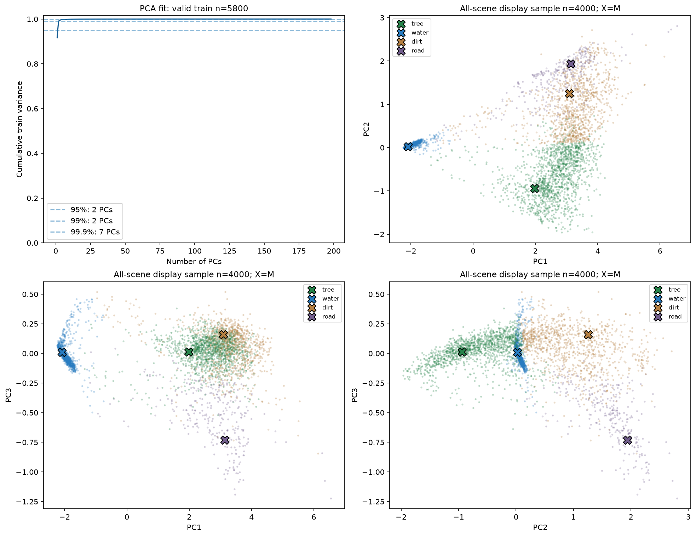

Cumulative variance train và ba panel PC1/2, PC1/3, PC2/3. Display sample seeded trên toàn cảnh, màu theo dominant A_ref chỉ để mô tả; X là M chiếu bằng cùng train mean/components.

[Explained variance đầy đủ 198 components](tables/pca_explained_variance.csv)

## 7. LMM reference và FCLS thực

R_ref=Y−M A_ref; R_fcls=Y−M A_fcls. Global spectral RMSE=sqrt(mean R²) trên band×pixel trong subset; per-pixel RMSE lấy mean trên band; per-band RMSE lấy mean trên pixel. SAM dùng uncentered spectra, radian; zero/nonfinite norm bị mask với số lượng defined được ghi. Global SRE=10log10(sum Y²/sum R²), không lấy mean SRE pixel; zero signal/error energy là undefined/null kèm status. aRMSE=sqrt(mean((A_fcls−A_ref)²)) chỉ là sai khác với reference.

| split | model | n_pixels | rmse | sre_db | sam_mean_radians | sam_defined_count | armse_vs_reference |
| --- | --- | --- | --- | --- | --- | --- | --- |
| all_valid_descriptive | reference | 10000 | 0.0550835 | 15.1635 | 0.11512 | 10000 | undefined |
| all_valid_descriptive | fcls | 10000 | 0.0432359 | 17.267 | 0.0906878 | 10000 | 0.0851283 |
| train | reference | 5800 | 0.0512851 | 13.5881 | 0.166599 | 5800 | undefined |
| train | fcls | 5800 | 0.0372545 | 16.3644 | 0.109603 | 5800 | 0.0794558 |
| val | reference | 1800 | 0.0563435 | 16.9888 | 0.0420315 | 1800 | undefined |
| val | fcls | 1800 | 0.046948 | 18.5733 | 0.0626731 | 1800 | 0.0880811 |
| test | reference | 2000 | 0.0636774 | 15.7224 | 0.0456154 | 2000 | undefined |
| test | fcls | 2000 | 0.0539011 | 17.1702 | 0.0665499 | 2000 | 0.0963353 |
| buffer | reference | 400 | 0.0561933 | 16.7145 | 0.0450914 | 400 | undefined |
| buffer | fcls | 400 | 0.046519 | 18.3556 | 0.0631791 | 400 | 0.0911811 |

Toàn cảnh, FCLS giảm RMSE phổ 21.5084% từ 0.05508350 xuống 0.04323594; SRE đổi từ 15.1635 dB sang 17.267 dB. Mean SAM đổi từ 0.11512 sang 0.0906878 rad. FCLS tối ưu reconstruction trên simplex với M cố định nên cải thiện loss so với A_ref feasible là kỳ vọng toán học; không chứng minh abundance đo thực địa tốt hơn. Sai khác còn lại có thể do cách tạo reference, M, scale, label correspondence hoặc variability.

Solver float64 duyệt đủ 15 nonempty supports (15 với E=4). Mỗi mặt giải equality-constrained LS bằng a=a0+Qz và lstsq(M_face Q, Y−M_face a0); so sánh objective trực tiếp trên các nghiệm feasible. Chỉ repair âm cỡ roundoff≤1e−10 rồi bảo toàn ASC, không dùng clip+normalize nghiệm LS unconstrained. Max ASC error=3.33067e-16, ANC violation=-0, max KKT=2.13163e-14, status=passed. KKT dùng objective ||Ma−y||², gradient=2Mᵀ(Ma−y), ν=−mean gradient trên active a>1e−9, μ=g+ν; báo active stationarity, dual nonnegativity, complementarity và primal feasibility; tolerance tổng 1e−7. Exact ở đây là xét hết mặt của bài toán convex bằng số float64, không phải số học ký hiệu chính xác.

Đối chiếu SLSQP seed=20260913 trên 128 pixel, khởi tạo đều [0.25]*4, ftol=1e−12, maxiter=1000: success=128/128; max |objective_face−objective_SLSQP|=9.34973e-13, max |A_face−A_SLSQP|=8.20506e-08; status=passed. Check phải thỏa objective_face−objective_SLSQP≤1e−8 và max abundance difference≤1e−5 với M local; abundance của nghiệm rank-deficient nói chung có thể không duy nhất, nên test synthetic suy biến cần so objective/reconstruction.

[Mọi sample SLSQP, status/message và sai khác objective/abundance](tables/fcls_slsqp_comparison.csv)

Signed bias=A_fcls−A_ref. Mỗi split có đủ bốn material; không gọi reference error là lỗi so với measured truth.

| split | material | fcls_armse_vs_reference | fcls_bias_vs_reference | fcls_mae_vs_reference |
| --- | --- | --- | --- | --- |
| all_valid_descriptive | tree | 0.0871455 | -0.0510835 | 0.0527833 |
| all_valid_descriptive | water | 0.0822853 | 0.0342507 | 0.0387157 |
| all_valid_descriptive | dirt | 0.0982443 | 0.0174354 | 0.059882 |
| all_valid_descriptive | road | 0.0704992 | -0.000602599 | 0.0307181 |
| train | tree | 0.0748035 | -0.0373304 | 0.0385414 |
| train | water | 0.0923717 | 0.0460425 | 0.0487917 |
| train | dirt | 0.0852329 | -0.00125673 | 0.04248 |
| train | road | 0.0621302 | -0.00745541 | 0.0272163 |
| val | tree | 0.104296 | -0.0720669 | 0.0753412 |
| val | water | 0.0548288 | 0.00989615 | 0.0224813 |
| val | dirt | 0.1135 | 0.051652 | 0.085334 |
| val | road | 0.0653218 | 0.0105188 | 0.0328641 |
| test | tree | 0.100365 | -0.0697299 | 0.070845 |
| test | water | 0.0748549 | 0.0246278 | 0.0265251 |
| test | dirt | 0.112618 | 0.0366996 | 0.0818624 |
| test | road | 0.0936093 | 0.00840246 | 0.0391558 |
| buffer | tree | 0.0969913 | -0.0628465 | 0.0674722 |
| buffer | water | 0.0632932 | 0.0209798 | 0.0266217 |
| buffer | dirt | 0.120733 | 0.0381752 | 0.0877747 |
| buffer | road | 0.0725686 | 0.00369144 | 0.0296501 |

Material sai khác reference lớn nhất theo aRMSE toàn cảnh là dirt: aRMSE=0.0982443, bias=0.0174354. Bias cùng bản đồ mismatch giúp nhận ra trao đổi tỷ lệ giữa vật liệu và shift theo không gian; không tự đổi hàng A/cột M để làm residual đẹp hơn.

A_fcls được suy từ Y,M; colorbar 0–1, giữ thứ tự local. Không đưa A_ref vào solver.

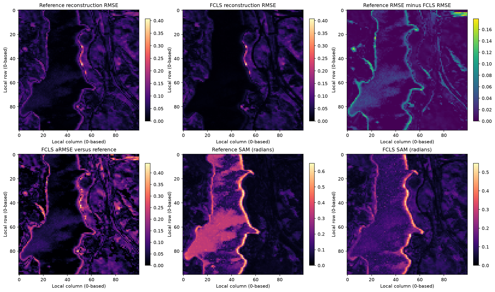

Residual RMSE reference/FCLS dùng cùng color limit; các panel còn lại là mức giảm RMSE, aRMSE-reference và SAM radian trên toàn cảnh hợp lệ.

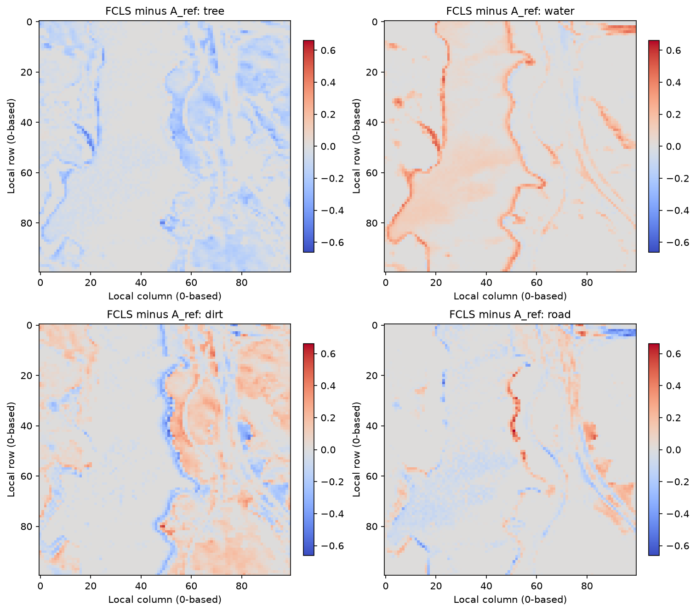

Signed abundance mismatch A_fcls−A_ref với color limit đối xứng chung cho bốn material. Đây là sai khác reference, không phải sai số ground truth đo thực địa.

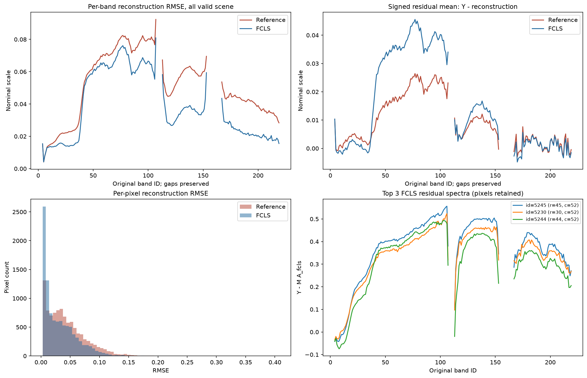

Residual theo band và pixel, bias có dấu Y−reconstruction và phổ ba pixel FCLS RMSE cao nhất. Đường phổ không nối qua band gaps; outlier được giữ.

## 8. Outlier được giữ và residual confounding

Policy cố định: flag high nếu value>median_train+6×1.4826×MAD_train. Khi MAD=0, threshold undefined và không flag bằng quy tắc này; status ghi rõ. Không auto-delete.

| quantity | median | mad | multiplier | mad_scale | threshold | status | fit_n |
| --- | --- | --- | --- | --- | --- | --- | --- |
| brightness | 0.0566833 | 0.0273707 | 6 | 1.4826 | 0.300162 | defined | 5800 |
| reference_rmse | 0.0287856 | 0.0194531 | 6 | 1.4826 | 0.201833 | defined | 5800 |
| fcls_rmse | 0.0101641 | 0.00569483 | 6 | 1.4826 | 0.060823 | defined | 5800 |

| split | flag | count | n | fraction |
| --- | --- | --- | --- | --- |
| all_valid_descriptive | brightness | 4778 | 10000 | 0.4778 |
| all_valid_descriptive | reference_rmse | 19 | 10000 | 0.0019 |
| all_valid_descriptive | fcls_rmse | 1508 | 10000 | 0.1508 |
| train | brightness | 1388 | 5800 | 0.23931 |
| train | reference_rmse | 19 | 5800 | 0.00327586 |
| train | fcls_rmse | 525 | 5800 | 0.0905172 |
| val | brightness | 1598 | 1800 | 0.887778 |
| val | reference_rmse | 0 | 1800 | 0 |
| val | fcls_rmse | 341 | 1800 | 0.189444 |
| test | brightness | 1461 | 2000 | 0.7305 |
| test | reference_rmse | 0 | 2000 | 0 |
| test | fcls_rmse | 563 | 2000 | 0.2815 |
| buffer | brightness | 331 | 400 | 0.8275 |
| buffer | reference_rmse | 0 | 400 | 0 |
| buffer | fcls_rmse | 79 | 400 | 0.1975 |

Top 5 mỗi ranking (CSV lưu top 20; cùng pixel có thể xuất hiện ở nhiều ranking). Pixel ID,row,col 0-based; split label 0=train,1=val,2=test,3=buffer,4=invalid.

| ranking | rank | pixel_id | row | col | split_label | brightness_mean_band | rmse_reference | rmse_fcls | dominant_reference_material | retained_in_clean |
| --- | --- | --- | --- | --- | --- | --- | --- | --- | --- | --- |
| brightness | 1 | 5245 | 45 | 52 | 0 | 0.795115 | 0.406956 | 0.396552 | road | True |
| brightness | 2 | 5230 | 30 | 52 | 0 | 0.76527 | 0.374467 | 0.363662 | road | True |
| brightness | 3 | 5244 | 44 | 52 | 0 | 0.738483 | 0.36479 | 0.344975 | road | True |
| brightness | 4 | 5551 | 51 | 55 | 0 | 0.660792 | 0.285021 | 0.268096 | road | True |
| brightness | 5 | 5235 | 35 | 52 | 0 | 0.656441 | 0.267692 | 0.255176 | road | True |
| reference_rmse | 1 | 5245 | 45 | 52 | 0 | 0.795115 | 0.406956 | 0.396552 | road | True |
| reference_rmse | 2 | 5230 | 30 | 52 | 0 | 0.76527 | 0.374467 | 0.363662 | road | True |
| reference_rmse | 3 | 5244 | 44 | 52 | 0 | 0.738483 | 0.36479 | 0.344975 | road | True |
| reference_rmse | 4 | 5551 | 51 | 55 | 0 | 0.660792 | 0.285021 | 0.268096 | road | True |
| reference_rmse | 5 | 5143 | 43 | 51 | 0 | 0.653201 | 0.278149 | 0.261266 | dirt | True |
| fcls_rmse | 1 | 5245 | 45 | 52 | 0 | 0.795115 | 0.406956 | 0.396552 | road | True |
| fcls_rmse | 2 | 5230 | 30 | 52 | 0 | 0.76527 | 0.374467 | 0.363662 | road | True |
| fcls_rmse | 3 | 5244 | 44 | 52 | 0 | 0.738483 | 0.36479 | 0.344975 | road | True |
| fcls_rmse | 4 | 5551 | 51 | 55 | 0 | 0.660792 | 0.285021 | 0.268096 | road | True |
| fcls_rmse | 5 | 5143 | 43 | 51 | 0 | 0.653201 | 0.278149 | 0.261266 | dirt | True |

[Top 20 brightness/reference residual/FCLS residual — giữ toàn bộ](tables/top_outliers_retained.csv)

| split | residual | feature | n | pearson | spearman | status |
| --- | --- | --- | --- | --- | --- | --- |
| all_valid_descriptive | reference_rmse | brightness | 10000 | 0.496622 | 0.609243 | descriptive_no_causal_inference |
| all_valid_descriptive | reference_rmse | purity_A_ref | 10000 | -0.345857 | -0.403193 | descriptive_no_causal_inference |
| all_valid_descriptive | reference_rmse | entropy_A_ref | 10000 | 0.363988 | 0.407784 | descriptive_no_causal_inference |
| all_valid_descriptive | fcls_rmse | brightness | 10000 | 0.674584 | 0.765542 | descriptive_no_causal_inference |
| all_valid_descriptive | fcls_rmse | purity_A_ref | 10000 | -0.253113 | -0.357458 | descriptive_no_causal_inference |
| all_valid_descriptive | fcls_rmse | entropy_A_ref | 10000 | 0.204505 | 0.3259 | descriptive_no_causal_inference |

Correlation residual–brightness trong từng dominant-reference stratum. Stratification vẫn dùng A_ref, chưa loại confounding hoàn toàn.

| split | dominant_reference | residual | feature | n | pearson | spearman | status |
| --- | --- | --- | --- | --- | --- | --- | --- |
| all_valid_descriptive | tree | reference_rmse | brightness | 3493 | 0.218796 | 0.418013 | descriptive_no_causal_inference |
| all_valid_descriptive | tree | fcls_rmse | brightness | 3493 | 0.586835 | 0.637942 | descriptive_no_causal_inference |
| all_valid_descriptive | water | reference_rmse | brightness | 3326 | 0.86718 | 0.866424 | descriptive_no_causal_inference |
| all_valid_descriptive | water | fcls_rmse | brightness | 3326 | 0.570732 | 0.52321 | descriptive_no_causal_inference |
| all_valid_descriptive | dirt | reference_rmse | brightness | 2428 | 0.26965 | 0.482381 | descriptive_no_causal_inference |
| all_valid_descriptive | dirt | fcls_rmse | brightness | 2428 | 0.638032 | 0.708679 | descriptive_no_causal_inference |
| all_valid_descriptive | road | reference_rmse | brightness | 753 | -0.152777 | -0.188892 | descriptive_no_causal_inference |
| all_valid_descriptive | road | fcls_rmse | brightness | 753 | 0.584245 | 0.601108 | descriptive_no_causal_inference |

reference_rmse: Pearson với brightness=0.496622, purity=-0.345857, entropy=0.363988; Spearman brightness=0.609243. Các hệ số này mô tả đồng biến trong scene đã quan sát; không có kiểm định causal hoặc giả thiết pixel độc lập.

fcls_rmse: Pearson với brightness=0.674584, purity=-0.253113, entropy=0.204505; Spearman brightness=0.765542. Các hệ số này mô tả đồng biến trong scene đã quan sát; không có kiểm định causal hoặc giả thiết pixel độc lập.

Residual tổng hợp sensor noise, lượng tử hóa raw, nominal scale, endmember variability, shade/brightness, reference-label mismatch và khả năng nonlinear mixing. Correlation với entropy không cô lập được phi tuyến: composition, độ sáng và cấu trúc không gian có thể cùng thay đổi. Spatial autocorrelation khiến p-value iid dễ gây hiểu nhầm; báo cáo chỉ đưa hệ số, sample counts và bảng theo split/stratum. Pixel outlier là ứng viên xem lại phổ/ảnh, chưa có bằng chứng để xóa hoặc gán lỗi vật lý.

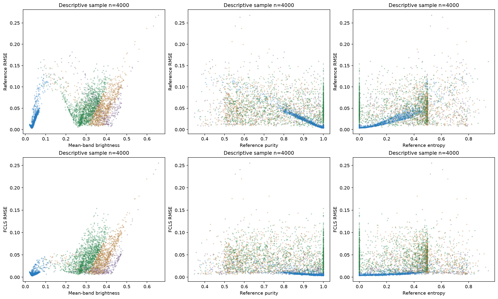

Scatter residual với brightness/purity/entropy, mẫu hiển thị seeded; màu dominant reference. Các hệ số trong bảng dùng toàn bộ valid pixels của subset, không chỉ display sample.

## 9. Kết luận định lượng cho QSiMix-Residual

Calibration: train có 3418 mixtures tại pure threshold 0.95 và coverage khác nhau giữa tree/water/dirt/road. Bảng pure theo material/split phải đi cùng mọi thử nghiệm mixture calibration; pure endpoints một mình không hiệu chuẩn nonlinear residual trong hard-anchor model. Cần giữ baseline FCLS và đối chứng classical anchored residual trong cùng scale/protocol, báo đồng thời reconstruction và abundance-reference mismatch.

Khả năng nhận dạng: cặp dirt/road gần hướng phổ nhất (13.0553°); sigma_min(MQ)=0.72536. Đây là mốc sensitivity tuyến tính để đọc mức sai khác abundance, không phải nonlinear inverse certificate. So sánh high-purity với M cho ứng viên variability/anchor mismatch; selection dùng generated reference không chứng minh vật liệu thuần vật lý hoặc nguyên nhân chênh lệch. Không sửa M trong EDA.

Miền mô hình: 3 pixel có Y>1 (max=1.0874) gây xung đột với pilot [0,1]. Trước training cần adapter hoặc nới miền có khai báo. Nếu chọn một scalar c từ train, áp dụng đồng bộ Y/c, M/c, residual/c và lambda/c; không clip test để ép miền và không tự đổi lambda trong task này. Brightness/proxy noise hiện tại không hiệu chuẩn physical SNR. Reference labels và M có hạn chế nguồn; kết quả trên split exploratory này chỉ hỗ trợ phát triển pipeline, cần đánh giá confirmatory độc lập cho claim nghiên cứu.

## 10. Tái lập và deliverable contract

Chạy từ repo root: .venv-jasper/Scripts/python.exe scripts/eda_jasper.py --root . Input bắt buộc: data/processed/jasper_ridge/jasper_clean.npz và manifest.json đúng §4. Matplotlib Agg; không notebook, sklearn hoặc mạng để render. HTML chỉ dùng CSS inline và PNG/CSV local; chuyển cả thư mục reports/jasper_ridge để đọc hình offline. Hai link source audit/QA phụ thuộc artifact agents khác; manifest link cần giữ cấu trúc repo.

Seed=20260913; versions={'python': '3.12.14', 'numpy': '2.5.3', 'scipy': '1.18.1', 'matplotlib': '3.11.2', 'pandas': '3.0.5'}. Input NPZ SHA256=ebfc7037d8f5b330b79506b377c71e9e7246c41b9ded62ac8374fde60506bee2; manifest SHA256=665e05b9054eb3075691ba230f33f5fbe11b3a952dac757008e654e560e543d8. Sign PCA được cố định theo loading lớn nhất; eigenspace suy biến có thể quay theo thư viện số. PCA và inverse tính float64; kết quả arrays và split tái lập trong cùng environment. Raw chỉ đọc, code EDA không ghi preprocessing hoặc source.

eda_summary.json: inventory là QC toàn cảnh; geometry chứa pairwise SAD rad/degree, singular values/rank/condition M,MQ; pca là fit valid train; reconstruction_by_split ghi spectral RMSE/SRE/SAM, abundance_by_material_split ghi mean/coverage/aRMSE/bias; fcls chứa 15 faces, KKT và SLSQP validation; robust_thresholds_train là fitted policy; residual_confounding_correlations là descriptive. JSON chuẩn allow_nan=False: undefined thành null kèm status; CSV undefined là ô trống. NPZ dùng NaN cho pixel invalid hoặc angle undefined, không object arrays.

eda_arrays.npz: A_fcls và A_fcls_minus_A_ref [4,N]; residual_reference/residual_fcls [B,N]; rmse_*_per_pixel, sam_*_radians_per_pixel, armse_fcls_vs_reference_per_pixel và diagnostics FCLS [N]. pca_mean_train [B], pca_components_train [K,B], pca_scores_all_pixels [K,N], pca_endmember_scores [K,4], K=198; scores=components@(Y−mean[:,None]). pca_fit_pixel_ids lưu đúng train IDs, pca_explained_variance*_train là train only. simplex_tangent_Q [4,3]; maps/proxies/flags [N], band_correlation_all_valid_descriptive [B,B]. Mọi per-pixel array cùng hệ ID gốc; row/col/split_labels/band_ids_original/material_names lưu kèm. fcls_support_bitmask dùng bit 0=tree,1=water,2=dirt,3=road; fcls_objective là sum squared spectral residual; fcls_*stationarity/dual_violation/complementarity là KKT theo convention §7. array_contract trong JSON liệt kê dtype/shape từng key.

[JSON số liệu và array schema](eda_summary.json)

[NPZ PCA/FCLS/residual/maps](eda_arrays.npz)

[abundance_by_material_split.csv](tables/abundance_by_material_split.csv)

[adjacent_band_difference.csv](tables/adjacent_band_difference.csv)

[band_correlation.csv](tables/band_correlation.csv)

[band_statistics.csv](tables/band_statistics.csv)

[endmember_pairwise.csv](tables/endmember_pairwise.csv)

[fcls_slsqp_comparison.csv](tables/fcls_slsqp_comparison.csv)

[high_purity_reference_vs_M.csv](tables/high_purity_reference_vs_M.csv)

[high_purity_spectra_threshold_0.95.csv](tables/high_purity_spectra_threshold_0.95.csv)

[mixture_coverage_by_split.csv](tables/mixture_coverage_by_split.csv)

[pca_explained_variance.csv](tables/pca_explained_variance.csv)

[pixel_statistics.csv](tables/pixel_statistics.csv)

[reconstruction_by_split.csv](tables/reconstruction_by_split.csv)

[residual_brightness_within_dominant_material.csv](tables/residual_brightness_within_dominant_material.csv)

[residual_confounding_correlations.csv](tables/residual_confounding_correlations.csv)

[robust_flags_by_split.csv](tables/robust_flags_by_split.csv)

[top_outliers_retained.csv](tables/top_outliers_retained.csv)
